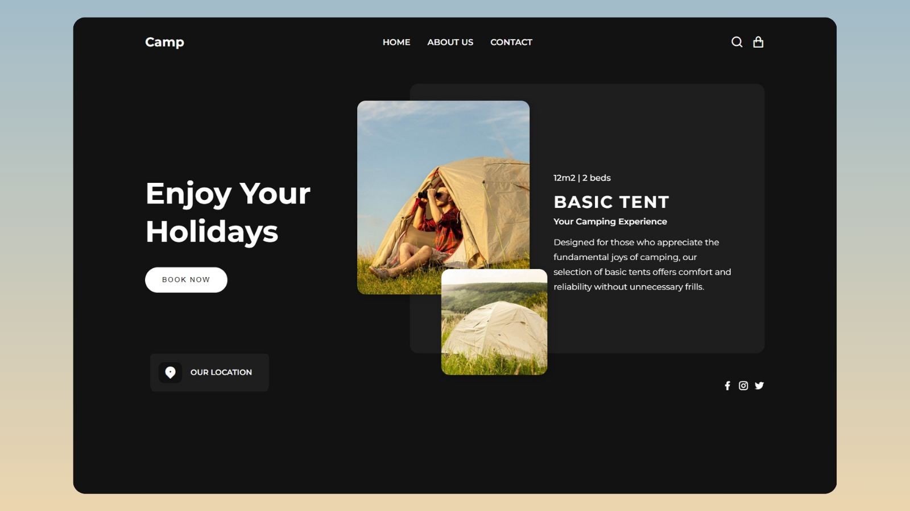

# Create-A-Responsive-Animated-Landing-Page

Unlock the power of web development with our comprehensive tutorial on creating a dynamic landing page using **HTML**, **CSS**, and **JavaScript**!

## 🚀 Live Preview

&nbsp;&nbsp;&nbsp;[Live Preview](https://codinggujarat.github.io/Create-A-Responsive-Animated-Landing-Page/)

## 🚀 Project Overview

This project demonstrates how to build a modern, responsive, and animated landing page from scratch. It uses clean HTML structure, CSS for styling and animations, and JavaScript for interactivity such as mobile navigation toggles.

## ✨ Features

- 🔥 Fully Responsive Layout  
- 🎨 Clean UI with modern design  
- 🌙 Dark theme ready  
- 🧠 Semantic HTML5 structure  
- 🖱️ Smooth animations using CSS  
- 📱 Mobile-friendly navigation toggle  
- 💡 Easily customizable code  

## 🛠️ Built With

- **HTML5** - Structure and content  
- **CSS3** - Styling, layout, and animations  
- **JavaScript** - Interactivity and dynamic behavior  

## 📸 Preview

 <!-- Add your screenshot or GIF here -->

## 📂 Project Structure

```plaintext
Create-A-Responsive-Animated-Landing-Page/
├── assets/
│   └── images
├── index.html
├── style.css
├── script.js
└── README.md
```

## 🧾 Getting Started

To get a local copy up and running, follow these simple steps:

### 1. Clone the repository

```bash
git clone https://github.com/codinggujarat/Create-A-Responsive-Animated-Landing-Page.git
cd Create-A-Responsive-Animated-Landing-Page
```

### 2. Open in Browser

You can simply open the `index.html` file in your browser.

> No need to install any libraries or dependencies!

## 📌 Usage

This landing page can be used for:
- Personal portfolios
- Startup or SaaS product landing pages
- Promotional websites
- Learning and practicing web development

## 🙌 Contributing

Contributions are welcome! Feel free to fork the repo and submit a pull request.

---